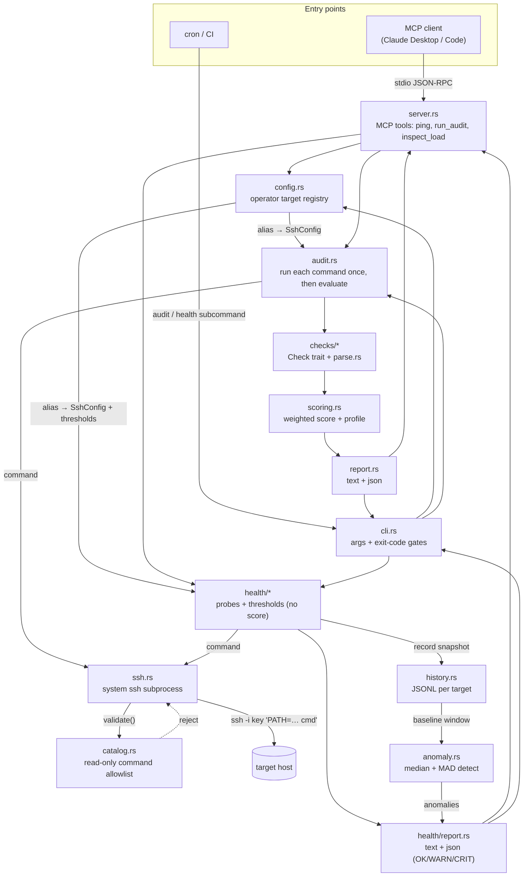
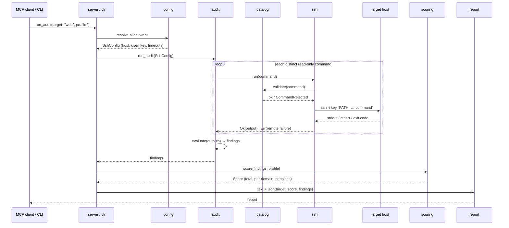

# Architecture

`linux-audit-mcp` performs a **read-only** security audit of a Linux host over
SSH and reports structured findings with a weighted score. It runs two ways over
the same core: an **MCP stdio server** (conversational use) and a **CLI**
(`audit` subcommand, for cron/CI). Both share the audit engine, the read-only
SSH transport, the scoring engine and the reporter.

Alongside the security audit it offers a separate **operational-health snapshot**
(`inspect_load` MCP tool / `health` CLI subcommand): load, memory, disk, hot
processes and connections as `OK`/`WARN`/`CRIT` against per-target thresholds. It
reuses the same SSH transport, command catalog and target registry, but is kept
deliberately **out** of the security path — a momentary workload is not a
hardening fact, so it produces no 0–100 score and never touches `scoring.rs`.

Each snapshot is also **recorded** (append-only JSONL per target, `history.rs`)
and compared against the host's own recent norm to surface **anomalies**
(`anomaly.rs`: robust median + MAD baseline). Anomalies are informational too —
they never affect the health status, the exit code, or the security score.

## Components & data flow

## Request flow — `run_audit`

Device-level failures (auth, connection, timeout) abort the whole audit and
surface as an error. A *per-command* remote failure (SSH connected but the
command errored — e.g. `apt-get` absent on RHEL) becomes an `Error` finding for
the checks that needed it; the rest still run and the errored check is excluded
from the score.

## Module map

| Module           | Responsibility                                                                 |
| ---------------- | ------------------------------------------------------------------------------ |
| `main.rs`        | Wires modules; routes CLI (no subcommand → `serve`, `audit`/`health`/`history` → one-shot).|
| `server.rs`      | MCP stdio server; tools `ping`, `run_audit`, `inspect_load` (target **alias**).  |
| `cli.rs`         | `audit`/`health`/`history` subcommands: flags, `--format`, exit-code gates.      |
| `config.rs`      | Operator inventory (`targets.toml`): targets + groups; `resolve(alias)` merges host/group/default vars; `group_members`. |
| `run.rs`         | Fan-out: run audit/health over one target or a group's members concurrently; per-host error capture; group text/JSON rendering. |
| `ssh.rs`         | SSH transport via `tokio::process`; key-only, timeouts; validates then sends.   |
| `catalog.rs`     | 🔒 Read-only command allowlist + charset filter. The core safety boundary.      |
| `audit.rs`       | Runs each distinct command once (cached), then `evaluate()` → findings (pure).  |
| `checks/mod.rs`  | `Check` trait, `Domain`/`Severity`/`Status`/`Finding`, `all_checks()`.          |
| `checks/parse.rs`| Tolerant pure parsers (sshd_config, passwd, sysctl, unit-files, ss).            |
| `checks/*.rs`    | The 20 checks, grouped by domain; each is a pure `evaluate(output) → Outcome`.  |
| `scoring.rs`     | Weighted 0–100 score, `baseline`/`hardened` profiles, severity penalties.       |
| `report.rs`      | Renders findings + score to text and JSON.                                      |
| `health/mod.rs`  | Health probes + `Thresholds`; `collect()` (I/O, incl. 2-sample net) and pure `evaluate()`; no score. |
| `health/parse.rs`| Tolerant pure parsers (uptime, free, df, ps, ss -s, /proc/net/dev, vmstat).      |
| `health/report.rs`| Renders the health snapshot (`OK`/`WARN`/`CRIT`) to text and JSON.              |
| `history.rs`     | Persists each health snapshot as append-only JSONL per target (`$LINUX_AUDIT_DATA_DIR`); `history` subcommand lists it. File-based, no DB.          |
| `anomaly.rs`     | Per-host anomaly detection over history: robust baseline (median + MAD), modified z-score + materiality gate. Pure; owns `AnomalyConfig` (imported by `config.rs`, no cycle). Informational — never touches score/status/exit. |
| `evals.rs`       | (test-only) per-distro fixture regression tests (audit **and** health).         |

## The read-only trust boundary 🔒

Two independent guards make it impossible for the server — or a prompt-injected
model driving it — to change a host or reach one it shouldn't:

- **Command safety (`catalog.rs`).** Every command a check issues must be a
  byte-for-byte member of a curated read-only catalog, and must contain no shell
  metacharacter (the remote `sshd` runs commands through a shell). Validation
  happens in `ssh.rs::run` *before* any process is spawned. A fixed, trusted
  `PATH=…` prefix is added to the wire command so `sbin` tools resolve; it never
  carries user input, so it can't widen what's allowed.
- **Connection safety (`config.rs`).** Tool/CLI arguments take a target **alias**
  or a **group** name, never a host or key path. Connection details live only in
  the operator-owned config, so the model cannot point the auditor at an arbitrary
  host (SSRF) or key. Host and user strings are charset-validated so they can't
  inject `ssh` options. Groups only expand to aliases already in the config.

Auditing stays unprivileged: the catalog contains only commands an ordinary user
can run against world-readable config. Anything needing root is intentionally
absent.

## I/O separation (why checks are trivial to test)

Every check splits into "what command do I need" (`command()`) and "what does the
output mean" (`evaluate(&str) → Outcome`, pure). `audit.rs` does all the I/O:
snap each command once, hand the text to `evaluate`. Because `evaluate` is a pure
function over captured text, checks and scoring are exercised against fixtures
with no host — that is exactly what the Stage 8 evals (`evals.rs` +
`tests/fixtures/<distro>/`) do.

## Adding a check

1. Add the read-only command to `READONLY_COMMANDS` in `catalog.rs` **if it
   isn't already there** (keep it dumb and unprivileged; parse in Rust).
2. Implement a `Check` in the right `checks/<domain>.rs` — `id`, `domain`,
   `severity`, `recommendation`, `command`, and a pure `evaluate`. Add a parser to
   `parse.rs` if the output shape is new.
3. Register it in `all_checks()` (`checks/mod.rs`).
4. Add a unit test next to the check, and a line to each `tests/fixtures/<distro>/
   expected.json` (add the command's output file if the command is new).

The invariant tests then enforce that every check's command is in the catalog and
that check ids are unique.

## Adding a health probe

The health snapshot mirrors the same I/O split. To add a metric: add its
read-only command to `catalog.rs` if new; add a tolerant parser to
`health/parse.rs`; write a probe function in `health/mod.rs` that turns parsed
input + `Thresholds` into a `Metric` (`Ok`/`Warn`/`Crit`, or `Unknown` when the
input is missing); include it in `evaluate()`. An invariant test asserts every
`HEALTH_COMMANDS` entry is in the catalog, and health evals pin per-metric status
against `tests/fixtures/<distro>/expected_health.json`. Thresholds stay in
`config.rs` (`[targets.x.health]`), never in tool arguments.

## Testing layers

| Layer            | Where                                   | Guards                                   |
| ---------------- | --------------------------------------- | ---------------------------------------- |
| Unit             | `#[cfg(test)]` in each module           | Parser + per-check logic, scoring formula |
| Invariant        | `checks/mod.rs`, `health/mod.rs`, `evals.rs` | Check + health commands ⊂ catalog; unique ids/slugs |
| Integration      | `tests/mcp_stdio.rs`                    | MCP handshake, tool advertisement, alias rejection |
| Evals            | `evals.rs` + `tests/fixtures/<distro>/` | Findings + scores, and health metric statuses, on captured output |

All run under `docker compose run --rm test`; lint (`fmt` + `clippy -D warnings`)
under `docker compose run --rm lint`. CI runs both in the same image.
